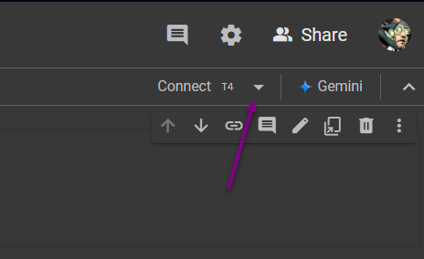
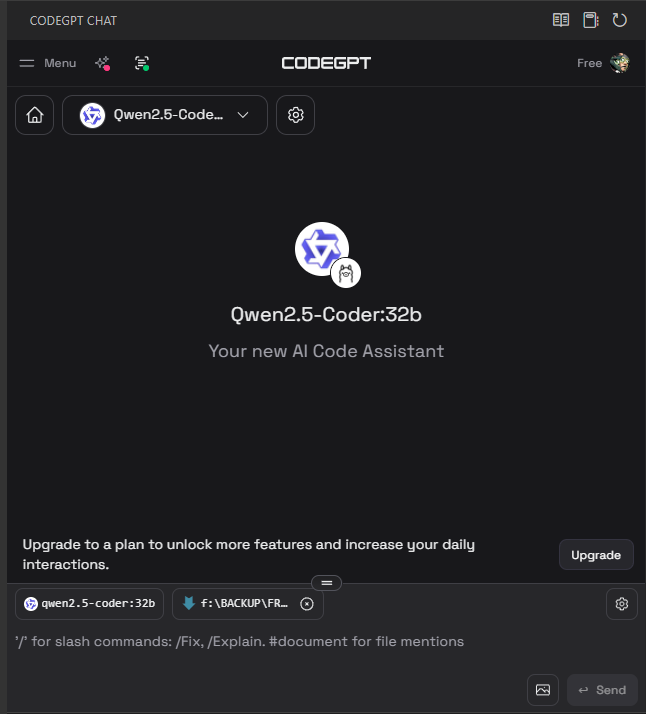
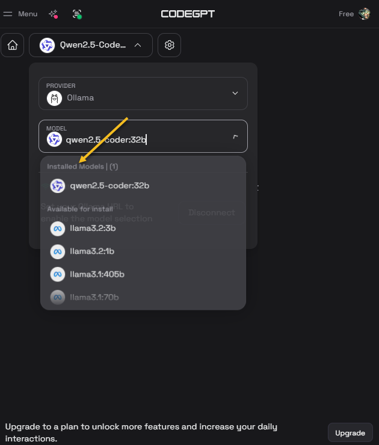

# Ollama on Google Colab - qwen2.5-coder-32b


This notebook allows you to run the Qwen 2.5 Coder (32B) language model on Google Colab using Ollama. The setup provides a public endpoint through ngrok, allowing you to interact with the model from anywhere.

## Prerequisites

1. **Google Account**
   - You need a Google account to use Google Colab
   - Visit [Google Colab](https://colab.research.google.com/)

2. **ngrok Account**
   - Free account required for public endpoint access
   - Sign up at [ngrok.com](https://ngrok.com)
   - Get your authtoken from [dashboard.ngrok.com/get-started/your-authtoken](https://dashboard.ngrok.com/get-started/your-authtoken)

## Setup Instructions

### 1. Google Colab Setup

1. Open the notebook in Google Colab
2. Select `Runtime` -> `Change runtime type`
3. Set "Hardware accelerator" to `GPU`
4. Click `Save`




### 2. ngrok Token Setup

1. Click the 🔑 (key) icon in the left sidebar to open "Secrets"
2. Click "Add new secret"
3. Set Name as: `authtoken`
4. Set Value as: your ngrok authtoken
5. Click "Add"

### 3. Running the Notebook

1. Run all cells in order
2. Wait for the model to download (approximately 20GB)
3. The notebook will display your public URL when ready

## System Requirements

- **GPU**: T4 or better (provided by Google Colab)
- **Storage**: At least 25GB free space (for model download)
- **RAM**: 12GB or more (provided by Google Colab)

## Model Information

- **Model**: qwen2.5-coder-32b
- **Size**: ~20GB
- **Type**: Code-specialized language model
- **Provider**: Qwen (Alibaba)

## Usage

### Accessing the Model

Once the notebook is running, you can access the model through:

1. The provided ngrok URL in the notebook output
2. Any Ollama-compatible client by pointing it to the ngrok URL
3. Direct HTTP requests to the API endpoints

### API Endpoints

- GET `/api/tags` - List available models
- POST `/api/generate` - Generate text
- POST `/api/chat` - Chat with the model

### Example cURL Request

```bash
curl -X POST https://your-ngrok-url/api/generate \
  -H 'Content-Type: application/json' \
  -d '{"model": "qwen2.5-coder:32b", "prompt": "Write a hello world program in Python"}'
```

### Use with VSCode Extension

Ex. CodeGPT

  
  
  

## Important Notes

1. **Session Duration**
   - Google Colab sessions have a limited runtime (usually 12 hours)
   - Save any important outputs before the session ends
   - The ngrok URL will change each time you restart the notebook

2. **Resource Usage**
   - Monitor GPU memory usage in Colab
   - The model requires significant GPU memory
   - Close other GPU-intensive notebooks

3. **Security**
   - The ngrok URL is publicly accessible
   - Anyone with the URL can access your model
   - Consider implementing additional authentication if needed

## Troubleshooting

1. **GPU Not Available**
   - Ensure you've selected GPU runtime in Colab
   - Check if you've hit Colab's GPU usage limits
   - Try disconnecting and reconnecting to runtime

2. **Model Download Issues**
   - Check your internet connection
   - Ensure enough free storage space
   - Try restarting the runtime

3. **ngrok Connection Issues**
   - Verify your authtoken is correct
   - Check if you've hit ngrok's connection limits
   - Ensure no firewall restrictions

## Contributing

Feel free to open issues or submit pull requests for improvements.

## License

This project is provided as-is under the MIT License. The Qwen model has its own license terms that should be consulted separately.

## Disclaimer

This is not an official Qwen or Ollama product. Use at your own risk and responsibility.
